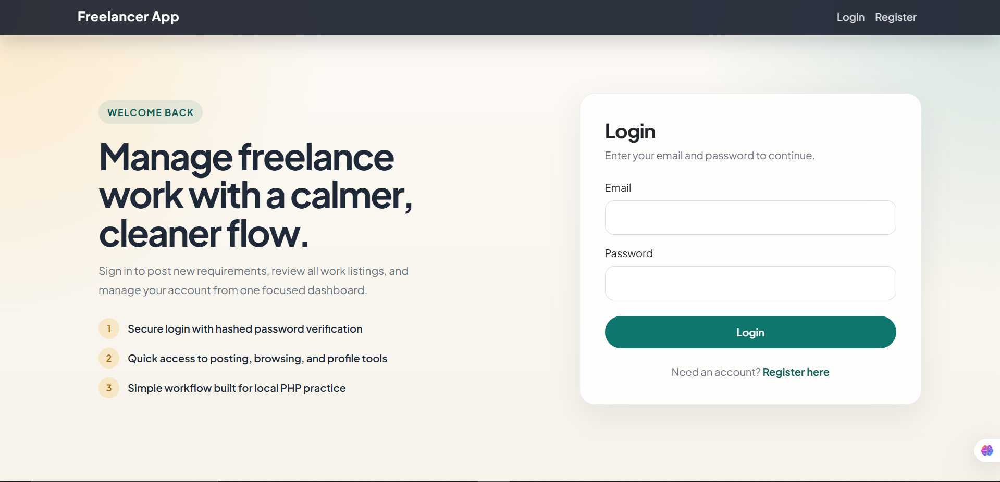
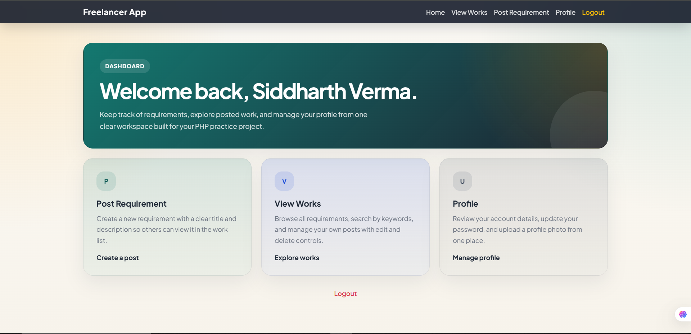
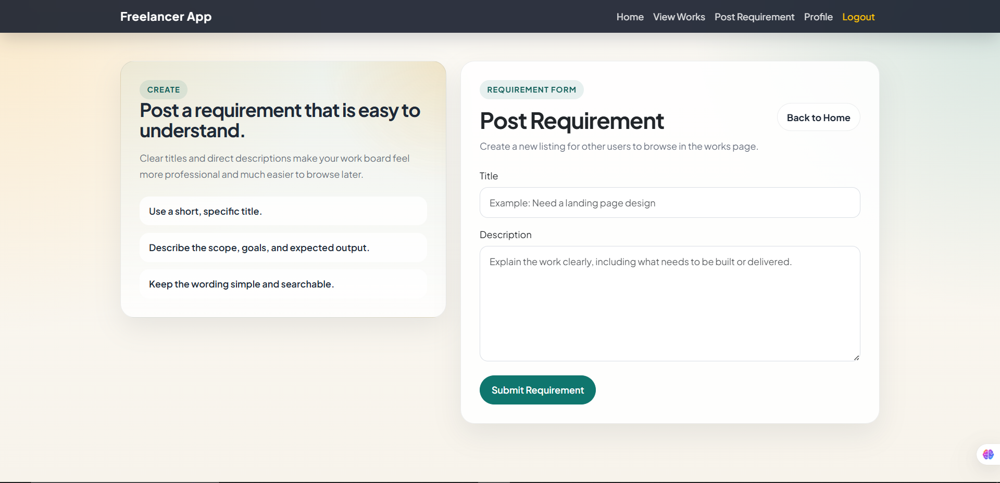
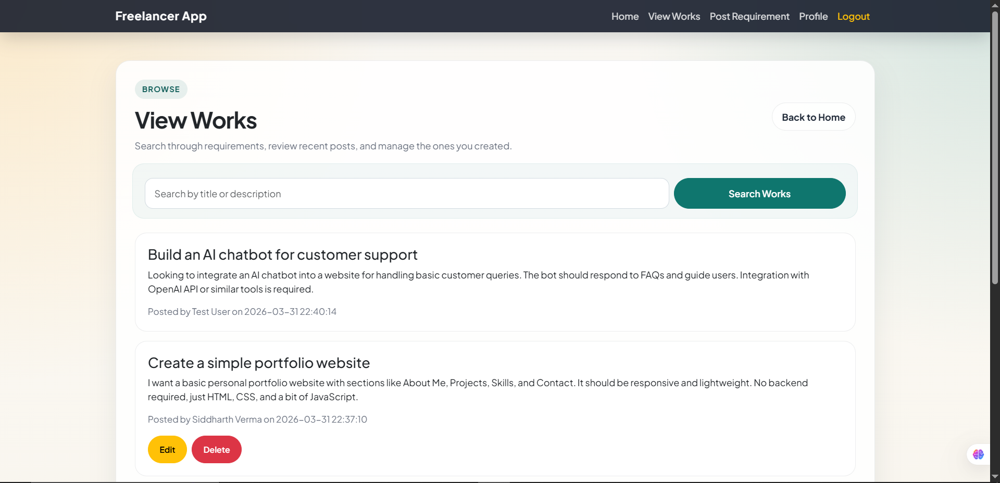
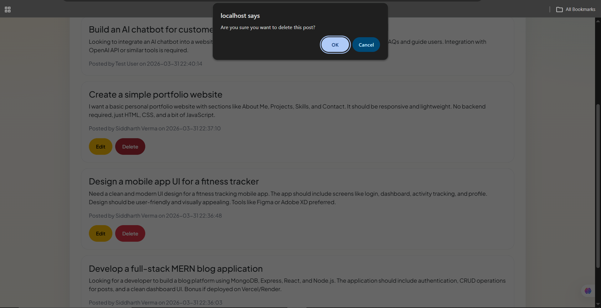
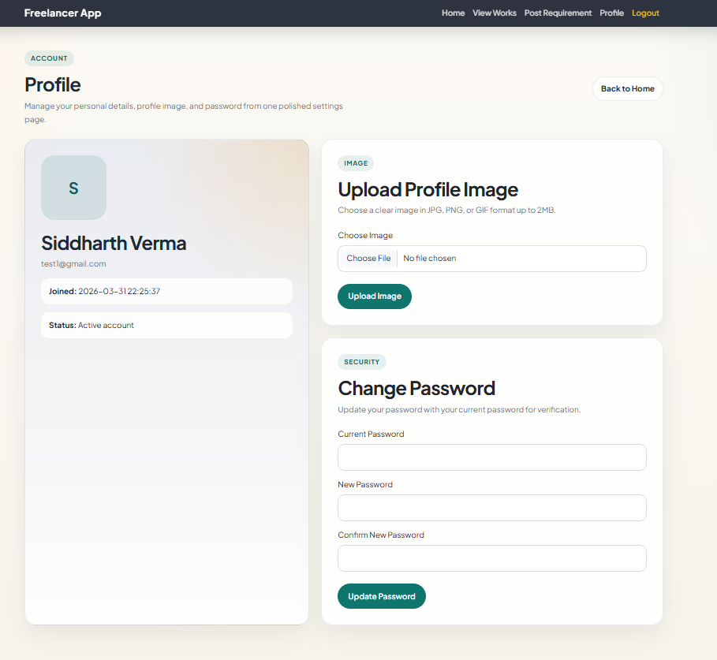

# PHP Freelance App

Mini freelancing-style CRUD web application built with core PHP, MySQL, Bootstrap, and XAMPP.

## Project Overview

This project includes:

- user registration
- user login and logout using sessions
- protected home page
- post requirement form
- works listing page
- edit and delete for the logged-in user's own posts
- search functionality
- pagination
- profile page
- change password
- profile image upload

## Tech Stack

- PHP
- MySQL
- Bootstrap 5
- XAMPP
- Git and GitHub

## Project Structure

```text
php_freelance_app/
│
├── assets/
├── auth/
├── config/
├── includes/
├── pages/
├── uploads/
├── .env.example
├── .gitignore
├── database.sql
├── index.php
└── README.md
```

## Screenshots

### Login Page

This screen shows the authentication entry point of the app.

Functionality shown:

- user login with email and password
- link to the register page
- clean landing layout for authentication



### Dashboard / Home Page

This screen shows the protected dashboard after login.

Functionality shown:

- quick access to post requirement
- quick access to view works
- quick access to profile
- logout option



### Post Requirement Page

This screen is used to create a new work requirement.

Functionality shown:

- create a new requirement post
- title input field
- description input field
- submit requirement button



### View Works Page

This screen lists all posted works.

Functionality shown:

- search by title or description
- display all works with title and description
- edit and delete buttons for the logged-in user's own posts
- pagination-ready works listing



### Delete Confirmation

This screen shows the delete confirmation popup for a work item.

Functionality shown:

- confirmation before deleting a post
- protects against accidental delete actions
- delete action is limited to the logged-in user's own posts



### Profile Page

This screen shows user profile management.

Functionality shown:

- user account summary
- profile image upload
- change password form
- account information display



## Full Setup Process

### 1. Download and Install XAMPP

1. Go to `https://www.apachefriends.org/`
2. Download XAMPP for Windows
3. Install XAMPP
4. Make sure these components are available:
   - Apache
   - MySQL
   - PHP
   - phpMyAdmin

Recommended install location:

```text
C:\xampp
```

### 2. Start Apache and MySQL

1. Open `XAMPP Control Panel`
2. Start:
   - `Apache`
   - `MySQL`
3. Make sure both show green/running

### 3. Place the Project in `htdocs`

Put the project folder inside:

```text
C:\xampp\htdocs\php_freelance_app
```

If you cloned the repo from GitHub, use:

```bash
git clone https://github.com/sidV214/php_freelance_app.git
```

If you downloaded it manually, just copy the folder there.

### 4. Create Local Environment File

This project uses a local `.env` file for database configuration.

Create a file named `.env` in the project root and add:

```env
APP_ENV=local
DB_HOST=localhost
DB_NAME=freelancer_app
DB_USER=root
DB_PASS=
```

Notes:

- `DB_PASS=` is empty by default in a normal local XAMPP setup
- `.env` is ignored by Git, so it will not be pushed to GitHub
- `.env.example` is the safe template file included in the project

### 5. Create the Database in phpMyAdmin

1. Open:

```text
http://localhost/phpmyadmin
```

2. Click `New`
3. Create a database named:

```text
freelancer_app
```

### 6. Import the SQL Tables

1. Open the `freelancer_app` database in phpMyAdmin
2. Click `Import`
3. Choose [database.sql](c:\xampp\htdocs\php_freelance_app\database.sql)
4. Click `Go`

This creates the required tables:

- `users`
- `works`

If import does not work, open the `SQL` tab in phpMyAdmin and paste the contents of [database.sql](c:\xampp\htdocs\php_freelance_app\database.sql).

### 7. Verify Database Config

The app reads DB configuration from [db.php](c:\xampp\htdocs\php_freelance_app\config\db.php), which loads values from `.env`.

Expected local values:

```env
DB_HOST=localhost
DB_NAME=freelancer_app
DB_USER=root
DB_PASS=
```

### 8. Open the Project in Browser

Open:

```text
http://localhost/php_freelance_app/
```

Main pages:

- `/` redirects to login or home
- `/auth/register.php`
- `/auth/login.php`
- `/pages/home.php`
- `/pages/view_works.php`
- `/pages/post_requirement.php`
- `/pages/profile.php`

## How to Use the App

### Register

1. Open:

```text
http://localhost/php_freelance_app/auth/register.php
```

2. Enter:
   - name
   - email
   - password
3. Submit the form

### Login

1. Open:

```text
http://localhost/php_freelance_app/auth/login.php
```

2. Login using the registered email and password

### Post a Requirement

After login:

1. Go to `Post Requirement`
2. Enter:
   - title
   - description
3. Submit

### View Works

Use the works page to:

- see all posted works
- search by title or description
- browse paginated results
- edit or delete your own posts

### Profile

Use the profile page to:

- view account details
- change your password
- upload a profile image

## Security/Implementation Notes

This project currently uses:

- `mysqli`
- prepared statements
- `password_hash()`
- `password_verify()`
- PHP sessions
- owner-only edit/delete authorization

## Files You Should Not Push

The following are ignored by Git in [\.gitignore](c:\xampp\htdocs\php_freelance_app\.gitignore):

- `.env`
- `.env.*` except `.env.example`
- uploaded files in `uploads/`
- `.vscode/`
- `.idea/`
- log/temp/cache files
- OS metadata files

That means:

- your local DB credentials in `.env` are not pushed
- uploaded profile images are not pushed

## GitHub Process

This is the process used to push the project to GitHub.

### 1. Install Git

Download Git for Windows:

```text
https://git-scm.com/download/win
```

### 2. Initialize Git

Inside the project folder:

```bash
git init
git config user.name "sidV214"
git config user.email "vermasid2107@gmail.com"
```

### 3. Add and Commit Files

```bash
git add .
git commit -m "Initial commit"
```

### 4. Connect GitHub Repo

```bash
git remote add origin https://github.com/sidV214/php_freelance_app.git
git branch -M main
git push -u origin main
```

GitHub repository:

```text
https://github.com/sidV214/php_freelance_app.git
```

## If You See a Database Error Page

If the browser shows the custom error page saying the database setup is incomplete:

1. confirm MySQL is running in XAMPP
2. confirm the database `freelancer_app` exists
3. confirm [database.sql](c:\xampp\htdocs\php_freelance_app\database.sql) was imported
4. confirm your `.env` values are correct

## Current Status

The project is:

- working locally
- pushed to GitHub
- structured for learning and CRUD practice
- ready for further improvement or future deployment work
